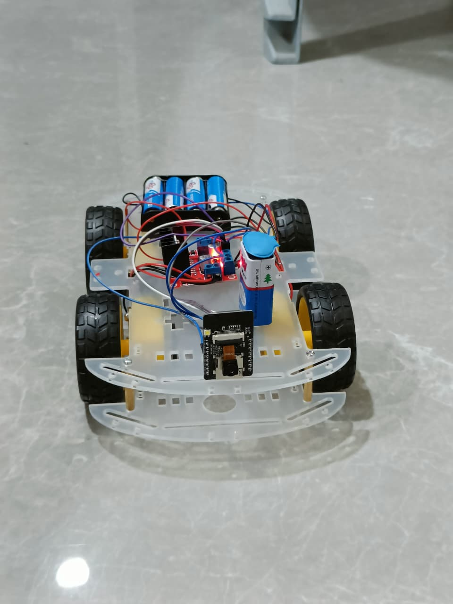
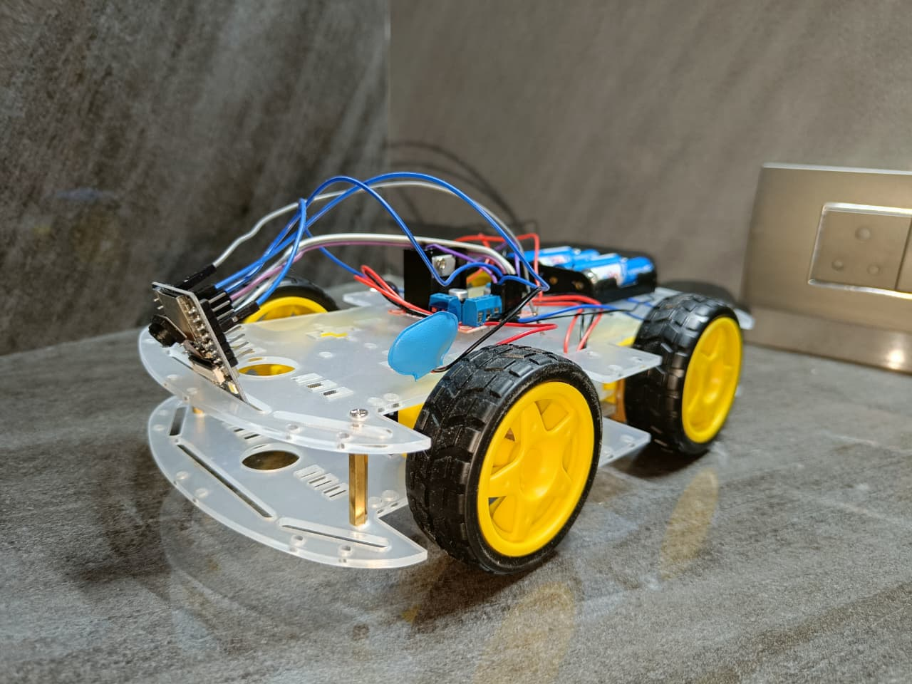
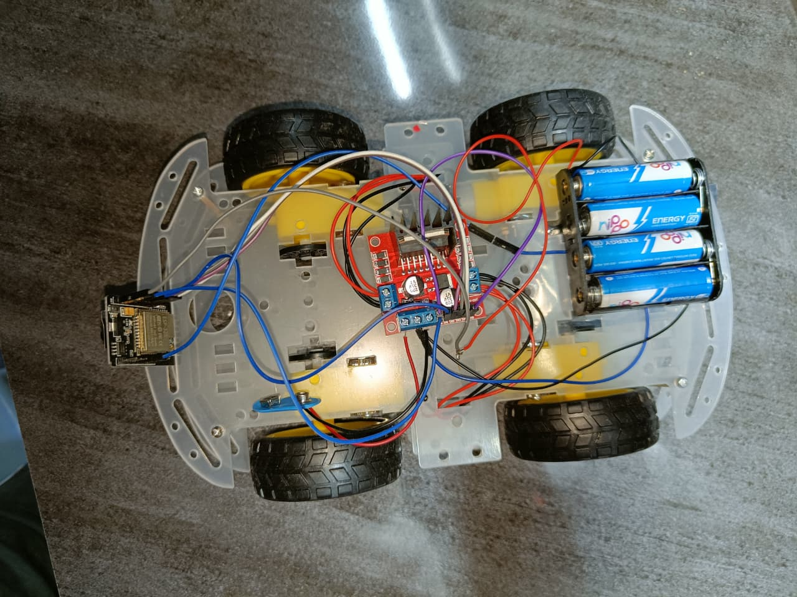

# 🚗 IoT Surveillance Car Using ESP32-CAM

An IoT-based smart surveillance vehicle that provides **real-time video streaming** and **wireless remote control** using the ESP32-CAM module. The vehicle is controlled through a web browser over Wi-Fi and is designed for surveillance, security monitoring, and remote inspection.

---

## 📸 Project Photos

  
  
  

---
## 🔌 Circuit Diagram

  

---
---

## ✨ Features

- 📷 Real-time live video streaming using ESP32-CAM
- 🚗 Wireless car movement control (Forward, Backward, Left, Right, Stop)
- 🌐 Web-based control interface accessible through any browser
- ⚡ Adjustable motor speed using PWM
- 💡 LED flash control for low-light surveillance
- 📡 Wi-Fi communication without additional hardware
- 🔋 Portable battery-powered system
- 🛡️ Suitable for surveillance and remote monitoring applications

---

## 🛠️ Hardware Components

| Component | Quantity |
|-----------|---------:|
| ESP32-CAM Module | 1 |
| L298N Motor Driver | 1 |
| DC Motors | 4 |
| Robot Chassis | 1 |
| Wheels | 4 |
| Battery Pack | 1 |
| Jumper Wires | As Required |
| Power Switch | 1 |

---

## 💻 Software Used

- Arduino IDE
- ESP32 Board Package
- C/C++
- HTML
- CSS
- JavaScript
- Wi-Fi Library
- ESP32 Camera Library

---

## ⚙️ Working Principle

The ESP32-CAM creates a Wi-Fi web server that hosts a control dashboard. A user connects to the ESP32-CAM through a web browser to view the live camera stream and control the vehicle. The L298N motor driver receives movement commands from the ESP32-CAM to drive the motors, while the camera continuously streams video for real-time surveillance.
---

## ✨ Features

- 📷 Live video streaming
- 🚗 Wireless vehicle control
- 🌐 Web-based interface
- ⚡ PWM motor speed control
- 💡 LED Flash support
- 📡 Wi-Fi communication
- 🔋 Battery powered
